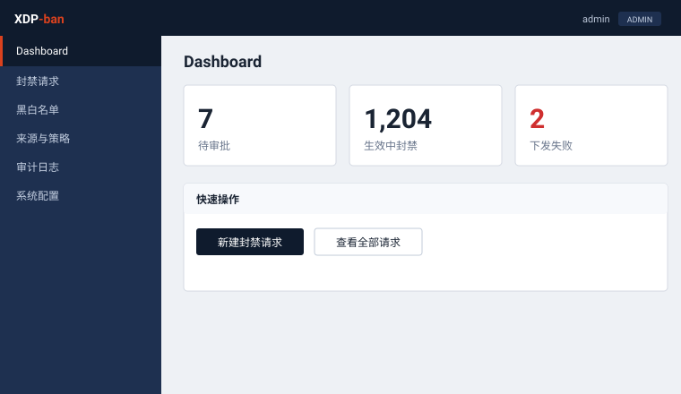

<div align="center">

# XDP-ban

**See it. Ban it.**

eBPF traffic sampling + governed banning — in a single binary.

English · [中文](README.zh.md) · [日本語](README.ja.md) · [한국어](README.ko.md)

</div>

---

Most tools can watch traffic **or** block it — never both, and never without a heavy stack behind them. XDP-ban does both, in static binaries you can copy and run.

It samples mirrored traffic with eBPF, surfaces what's hitting your hosts, and lets you ban it — through real approvals, roles, and an audit trail. Bans execute in **XDP**, at the earliest point in the kernel, with escalating durations for attackers who keep knocking.

<div align="center">
 
 
</div>

## Features

- **See it, ban it** — 1/N packet sampling on mirrored traffic, then one-click banning.
- **Governed** — approvals, four-eyes principle, role-based access, immutable audit log, one-time email approval links.
- **Escalating bans** — repeat offenders get progressively longer bans, up to permanent.
- **Scoped bans** — pick source ranges by **country / ASN**, protect a single target host. Impact is previewed and quota-checked before submission.
- **Pure XDP enforcement** — no nftables, no iptables. The agent writes eBPF maps directly.
- **Single binaries** — pure Go, `CGO_ENABLED=0`, no external DB. Copy and run.

## Architecture

Three binaries, each independently deployable:

| Binary | Role | Needs root |
|---|---|---|
| `xdp-ban` | Control plane: web UI, approvals, SQLite | no |
| `xdp-agent` | Enforcement: polls for orders, writes XDP ban maps | yes |
| `xdp-sampler` | Observation: 1/N sampling on the mirror port, reports flows | yes |

```
switch mirror ──▶ [eth1] xdp_sampler.o ──ringbuf──▶ xdp-sampler ──HTTP──▶ xdp-ban
                                                                            │
production ─────▶ [eth0] xdp_filter.o ◀──eBPF map── xdp-agent ◀──HTTP───────┘
```

Sampling is **out-of-band**: it observes a copy of the traffic and always returns `XDP_PASS`. Enforcement is a separate program on the production NIC.

## Quick start

Download the binary and run it. No dependencies, no build step — the eBPF objects are already inside.

```bash
# x86_64
curl -L -o xdp-ban https://github.com/githubflyideas/xdp-ban/releases/download/v0.23/xdp-ban-linux-amd64
# arm64: replace amd64 with arm64 in the URL above

chmod +x xdp-ban
./xdp-ban    # http://localhost:8080  (default admin / admin12345 — change it)
```

Data lives in a single `xdpban.db` file. Back up = copy the file.

Data plane (root, on the hosts doing the work) — same download pattern for `xdp-sampler` and `xdp-agent`:

```bash
curl -L -o xdp-sampler https://github.com/githubflyideas/xdp-ban/releases/download/v0.23/xdp-sampler-linux-amd64
curl -L -o xdp-agent   https://github.com/githubflyideas/xdp-ban/releases/download/v0.23/xdp-agent-linux-amd64
chmod +x xdp-sampler xdp-agent

sudo ./xdp-sampler -d eth1 -url http://<control>:8080/api/v1/samples -n 100 -key <API_KEY>
sudo ./xdp-agent   -server http://<control>:8080 -key <API_KEY>
```

All releases: https://github.com/githubflyideas/xdp-ban/releases

## Traffic analysis (ElastiFlow)

The sampler can export sampled flows as **NetFlow v5** to ElastiFlow for
visualization, alongside its report to xdp-ban. Add `-netflow <collector>:2055`:

```bash
sudo ./xdp-sampler -d eth1 -url http://<control>:8080/api/v1/samples \
     -n 100 -key <API_KEY> -netflow 127.0.0.1:2055
```

A ready-to-run stack (Elasticsearch + Kibana + ElastiFlow) lives in
[`deploy/elastiflow/`](deploy/elastiflow/) — `docker compose up -d`, then point
the sampler at `udp/2055`. The sampling rate is written into every packet so
ElastiFlow restores true traffic volume automatically. See
[deploy/elastiflow/README.md](deploy/elastiflow/README.md) for why NetFlow v5
and not IPFIX.

## Scoped bans (country / ASN)

```bash
curl -O https://iptoasn.com/data/ip2asn-v4.tsv.gz
XDPBAN_PREFIX_DB=./ip2asn-v4.tsv.gz ./xdp-ban
```

Without it, everything else works and the UI tells you the feature is unavailable.

## Configuration

| Variable | Default | Purpose |
|---|---|---|
| `XDPBAN_DB` | `xdpban.db` | SQLite file path |
| `XDPBAN_ADDR` | `:8080` | Listen address |
| `XDPBAN_API_KEY` | `changeme` | Shared key for agent/sampler API |
| `XDPBAN_BASE_URL` | `http://localhost:8080` | Prefix for email approval links |
| `XDPBAN_SAMPLER_URL` | `http://localhost:9090` | Sampler control endpoint |
| `XDPBAN_PREFIX_DB` | — | Path to `ip2asn-v4.tsv[.gz]`; enables scoped bans |
| `XDPBAN_COOKIE_SECURE` | — | Set to any value when behind TLS |
| `XDPBAN_PPROF` | — | Set to any value to expose `/debug/pprof` (bind to a private interface only) |

## Build from source

Only needed if you're hacking on it — released binaries already bundle the eBPF objects.

```bash
make bpf      # compile eBPF (needs clang)
make build    # build the three binaries
make check    # go vet + go test -race
```

Engineering notes — concurrency model, error-handling conventions, Go/eBPF boundary, and measured profiling results — are in [ENGINEERING.md](ENGINEERING.md).

## License

Apache-2.0. See [LICENSE](LICENSE).
